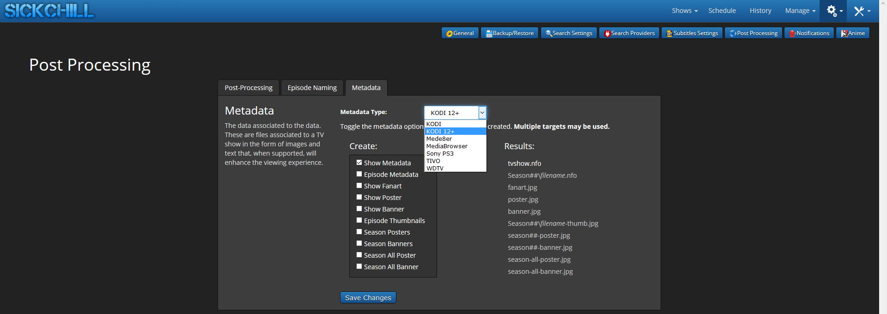
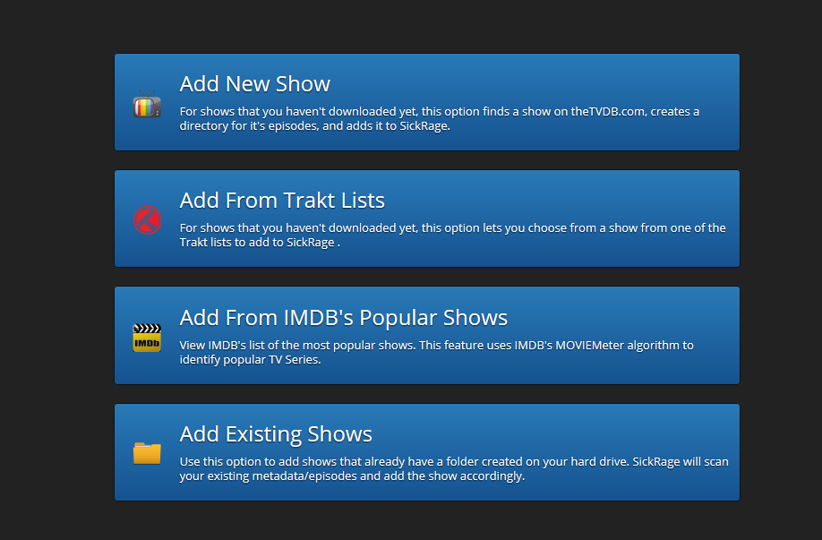
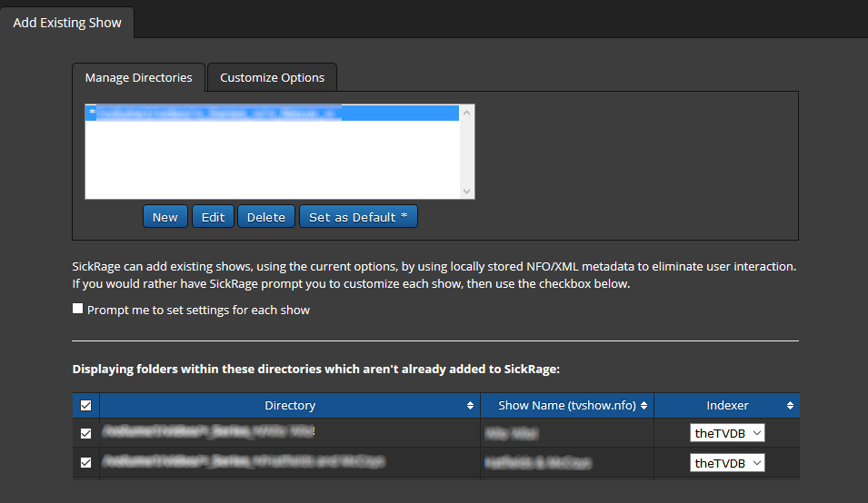

## What is MetaData?

Metadata is a name for a collection of files that contain information about a show or episodes (like actors, show id's, etc.) and images (posters, fan art etc.).
Many third-party media players use those files to display additional information about a show, or it's used to show descriptions in your native language. The files are called `tvshow.nfo` or `poster.jpg` etc.
For SickChill they can come in handy when starting a fresh install or reinstalling.
When SickChill finds the metadata file(s) in your shows folder, it will detect all the necessary data like the tvdbid to add the show without searching the [thetvdb](https://thetvdb.com/) website.
The real advantage comes when you have many show folders that have metadata. SickChill will detect those shows automatically and you can mass-add all the shows with a simple click.
This allows the building of a fresh database to be extremely quick.

## What metadata type should I use?

This depends on the type of media player you use. Your Western Digital player may use other files than your KODI player.
The most universal is probably the KODI 12+ type. And that is the one we advise to use.
Also, you don't have to use metadata in combination with a player, as it's also handy to use the metadata with SickChill.

## What metadata do I need?

Again depends on the situation. But it's generally advised to at least add the `Show Metadata` file for a show.
That will allow you to add the shows to SickChill with a simple click.

## How to setup metadata.

First, go to Settings --> Post processing --> Metadata.
You will be presented with the below screen.

Here select the type of metadata you need. Make sure you select the type that your media player supports.
The next step is selecting the metadata files you need. This depends on your preferences, but we advise adding the `Show Metadata` at a minimum. You can also select poster/banner in case you prefer to store those on your disk so that SickChill doesn't have to download them.  
Push on `save` and the settings are saved, and with the next show update the metadata files will be created.

## How can I use metadata in SickChill?

In this example, we have metadata created/added to a show folder and start with a fresh installation of SickChill.
Click on add shows and select `add existing shows`.

If the root folder is set, SickChill will show you a list of the found folders.
Select the folders/shows you like and click on the submit. If the metadata is present the shows will be instantly added.

Now you have created a new/fresh show database with just a few clicks!
