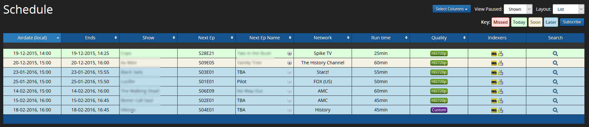
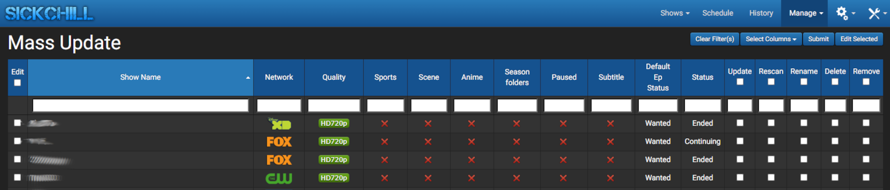

---

[ [Shows] ](#shows) [ [Schedule] ](#schedule) [ [History] ](#history)
[ [The Manage menu] ](#the-manage-menu) [ [Mass Update] ](#mass-update) [ [Backlog overview] ](#backlog-overview) [ [Manage Searches] ](#manage-searches) [ [Episodes Status Management] ](#episodes-status-management) [ [Failed Downloads] ](#failed-downloads) [ [Missed Subtitle Management] ](#missed-subtitle-management) [ [Logs & Errors Menu] ](#logs--errors-menu) [ [Options (wrench and screwdriver)] ](#options-wrench-and-screwdriver)

---

## Shows

- Gives you an overview of the shows you have added.

`Select Column`

- `Next episode` Adds the column Next episode that will show you when the next episode airs.

- `Prev episode` Adds the column Previous episode that will show you when the last episode aired.

- `Show` Adds the column with the shows banner or poster.

- `Network` Adds the column Network that will show you on what network the show airs.

- `Quality` Adds the column Quality that will show you what quality is set.

- `Downloads` Adds the column Downloads that will show you how many episodes are downloaded an aired.

- `Active` Adds the column Active that will show you if a show Is paused or not.

- `Status` Adds the column Status that will show you if a show has stopped and no new releases will be aired.

`Layout`

- `Poster`  
  
- `Small Poster`  
  
- `Banner`  
  
- `List`  
  

`Search:` Lets you search for an individual show name on the page.

## Schedule

`Layout:`

- `Calendar` Shows Coming Episodes as calendar with posters  
  
- `Banner` Shows Coming Episodes as list with large Banners  
  
- `Poster` Shows Coming Episodes as list with posters  
  
- `List` Shows Coming Episodes as a basic list with no posters or banners  
  

`Sort By:`

- `Date`  
  Allows you to sort the shows by Date
- `Network`  
  Allows you to sort the shows by Network
- `Show`  
  Allows you to sort the shows by Show name

`View Paused:`  
Allows you to hide or show paused shows in the overview

## History

`Clear history`  
Allows you to clear the history.  
`Trim History`  
Allows you to trim the history to just 30 days.

`Limit:`  
Allows you to select how many events should be shown in History.

`Layout:`

- `Detailed`  
  The Detailed view shows you the most information of the entry's
- `Compact`  
  The Compact view shows you the basic information of the entry's, main difference with Detailed is that plain names are removed and only icons are left

## The Manage menu

This Pull down menu gives you various Manage options to maintain your shows.

## Mass Update

- Mass Update is a very powerful tool that allows you to change settings of multiple shows at once. So no more need to go over every single show/episode and change the setting.

The screen shows you an overview of your shows and what settings they use/have set.
Here you can mainly start processes concerning your shows, like removing or starting a subtitle search :

`update`
Forces a full update of your shows data from the indexer. Replaces the old data in the database. Can be helpful in case you have problems with air dates, metadata etc.  
`rescan`  
Rescans all the files in your shows folder. Episodes,subtitles and metadata. etc.  
`Rename`  
Starts the Renaming proses to rename all the files as you have set under post-processing renaming.  
`search subtitle`  
Starts the subtitle search for your show.  
`Delete`  
Deletes the Show AND files. Don't confuse it with the Remove function.!  
`Remove`  
Removes the show from SickChill. Leaves all files and folders intact.

To modify the settings of the show itself you have to select the show(s) and push the edit button.  
Now you have the opportunity to set the following settings for all selected shows :

`Quality`

`Archive on first match`  
Enable/disable Archive on first match for the shows.  
`Flatten Folders`  
Enable/disable Flatten Folders for the shows.  
`Paused`  
Enable/disable Paused for the shows.  
`Default episode status`  
Set the Default episode status for all selected shows  
`Scene numbering`  
Enable/disable Scene numbering for the shows.  
`Anime`  
Enable/disable Anime for the shows.  
`Sports`  
Enable/disable Sports for the shows.  
`Air by date`  
Enable/disable Air by date for the shows.  
`subtitles`  
Enable/disable subtitles for the shows.

For more details on the functions them self see the [show settings explanation](Show-settings-explained).

## Backlog overview

- The Backlog Overview gives you an overview of what shows are wanted but not successfully downloaded by the Daily search. In case the episode has the color Yellow, SickChill will search that episode in a higher quality.  
  

## Manage Searches

- This page will allow you to force a :
  - Daily search
  - Backlog search
  - Find propers search

## Episodes Status Management

- Lets you change the Episode status of a certain type to another.

First select the episodes that you want to change. For example, you want to set all `skipped` episodes to `wanted`. When selected push on Manage.

Now you see a new screen witch is almost identical, You now you have to select the `skipped` shows/episodes and set the new status that you want. In our example that is `Wanted` so select `Wanted` and click on Go. Now all the `Skipped` shows that you had selected are set to wanted.

## Failed Downloads

- Allows you to see the Failed Downloads list.

This pages shows you an overview of all the NZB/Torents that are marked as Failed. In case an NZB/Torrent was wrongly placed in the list you have the possibility to remove it. From time to time you get a bad NZB/Torrent. To prevent SickChill from downloading that same file again you have to add it to the Failed Download list. (failed.db) Otherwise you run the risk that SickChill picks the same file again. If you use NZBtoMedia (nzbtosickbeard for example) this is done automatically. With other methods this is not always the case. When that happens you can go to your show and select the episode and set the episode status to failed. Or you can click on the search glass at the end of the episode line for a manual search. You will get a pop-up screen asking if SickChill should mark the episode as Failed.

## Missed Subtitle Management

- Lets you search for missing subtitles of your shows.

First you need to select the language that you want to search. You can select an individual language or all that you have set in the subtitle settings.

Next you have to select the shows and/or episodes that you want the subtitles to be found for. Select go to start the process.

## Options (wrench and screwdriver)

**News**

Here we try to keep you uptodate with the latest news. Be sure to check the page from time to time.

**Discord**

Here you can connect directly to the [SickChill Discord](https://discord.gg/U8WPBdf). Join other users for friendly discussions or to ask questions with SickChill.

**Changelog**  
Shows the page with the Changelog. This lets you see the changes that where made to SickChill and what new functions where added.

**Support SickChill**

**View Log**

## Logs & Errors Menu

- Allows you to see the log file and errors

**View logs (Errors)**

In case SickChill encounters an error it will be shown on this page. Common errors are timeout errors like when a site is down. Or when you enter a wrong user-name/password. This page will be a great help in case you have an issue. The error will give you an indication where to search for the problem. From time to time you can encounter a "Bug" meaning an error is SickChill's code. Whit so many features, improvements and possible settings that can not be prevented. To make reporting a bug easy a button will appear called `Submit Errors`
When you push this button you will get a pop-up screen to ask if you want to submit the error to the SickChill Developers. The error will then be investigated. However, before submitting make sure it is an actual error and if it is already reported or not. Also, for this function to work you have to setup/add your GitHub account to the SickChill settings and have the debug log setting enabled.

`Clear Errors`  
Clears the errors from the page (Yellow Arrow)

`Submit Errors`  
Lets you submit an error to the SickChill developers (Red Arrow)

**View logs**

`Minimum logging level to display`

- `DB`  
  Shows all available log information?
- `Debug`  
  Shows Debug/Info/Warning/Error log information?
- `Info`  
  Shows Info/Warning/Error log information?
- `Warning`  
  Shows Warning/Error log information?
- `Error`  
  Shows only Error log information?

`Filter log by:`

- `Backlog`  
  Shows only the Backlog events
- `Check Version`  
  Shows only the Check Version events
- `Daily Searcher`  
  Shows only the Daily Searcher events
- `Error`  
  Shows only the Error events
- `Event`  
  Shows only the Event events
- `Find Proper`  
  Shows only the Find Proper events
- `Find Subtitle`  
  Shows only the Find Subtitle events
- `Main`  
  Shows only the Main events
- `Post processor`  
  Shows only the Post processor events
- `Search Queue`  
  Shows only the Search Queue events
- `Show Queue`  
  Shows only the Show Queue events
- `Show Updated`  
  Shows only the Show Updated events
- `Tornado`  
  Shows only the Tornado events
- `Trakt Checker`  
  Shows only the Trakt Checker events
- `Trakt Rolling`  
  Shows only the Trakt Rolling events
- `Threat`  
  Shows only the Threat events

`Search log by:`  
Enter a specific search string

**Check for Updates**

Lets SickChill check if there are any new updated and notify you.

**Restart**  
Restarts ScikRage

**Shutdown**  
Shuts down SickChill

**Logout**  
Logs-out the current user

**Server status**

- Shows what processes are currently running or paused

`Show Queue`  
Shows the list of queued show processes. When active you will see a list of shows that still need to get processed.
