---

[ [Help & Info] ](#help--info) [ [General] ](#general) [ [ Backup ] ](#backup) [ [Search settings] ](#search-settings) [ [Search providers] ](#search-providers)
[ [Subtitles search] ](#subtitles-search) [ [Post processing] ](#post-processing) [ [ Notifications] ](#notifications) [ [Anime] ](#anime)

---

## The settings (gearwheels) section explained.

- This is the section where you configure SickChill to your likings.  
  As you can see below SickChill supports a massive amount of customization settings, and might lead to some confusion. With this wiki we will try to explain the settings in more details. As many of those settings are for advanced user only, make sure you understand what the setting does before setting.

## Help & Info

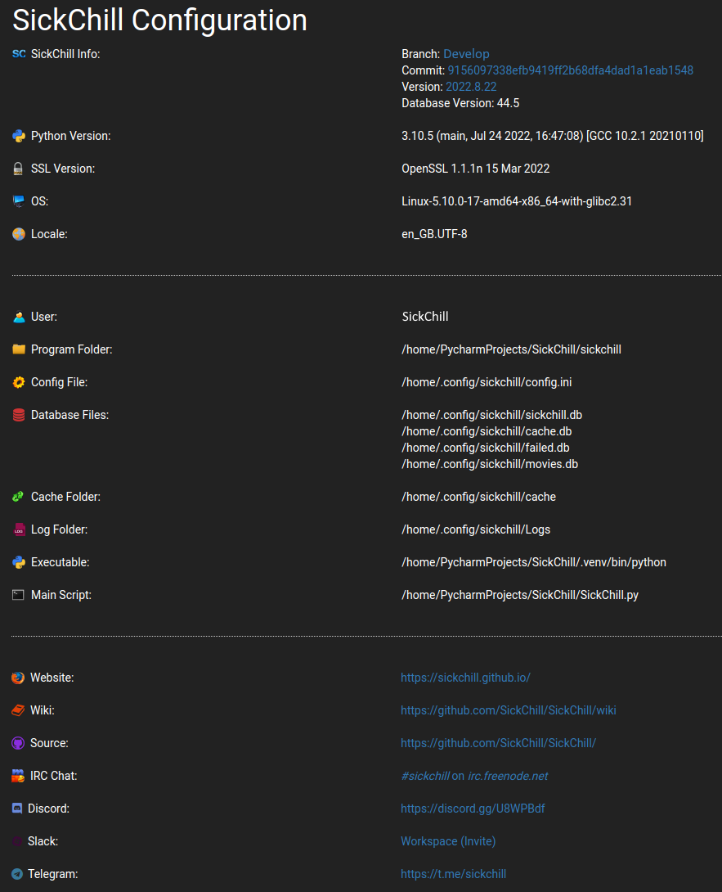

- `SickChill Info:`  
  This shows the version of SickChill you are running, you can tell if you missed updates along with Python, SSL, and OS to help you or the Developers trouble shoot a problem you have.
- `Python Version:`  
  This shows your Python version. SickChill needs a minimal version of 3.6 but the more recent the better. Also make sure pyopenssl and cryptography modules are included in your Python version.
- `Locale:`  
  This shows your Locale (language) setting that your system uses. Its strongly advised that u use UTF-8 to prevent any problems with special characters.
- `User:`  
  This shows the user on your system that is running SickChill.
- `Program Folder:`  
  Shows the location of your SickChill program folder.
- `Config File:`  
  Shows the location of your config.ini file. It includes all your settings for SickChill.
- `Database Files:`  
  Shows the location of your database files. It includes all your shows for SickChill.
- `Cache Folder:`  
  Shows the location of your cache folder. It includes all your search data, banners and other temporary files for SickChill.
- `Log Folder:`  
  Shows the location of your sickchill.log file. It includes all the events, warnings and errors. If you ever experience problems or issues, the log will be your best friend.
- `Executable:`  
  Shows the location of the Python executable.
- `Main Script:`  
  Shows the location of the main sickchill.py used to start SickChill.
- `Website, Wiki, Source, IRC Chat, Discord, Slack, Telegram:`

Key resource links should you wish to chat or fix something that's gone wrong.

## General

#### Misc

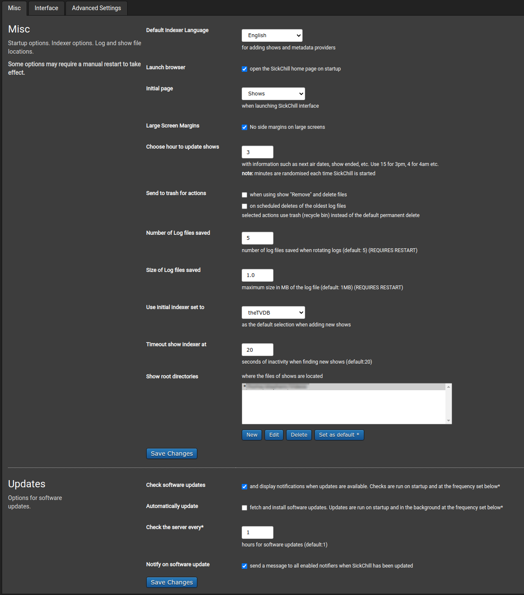

- `Default Indexer Language:`  
  With this setting you set the default language that needs to be used for your shows and metadata. Note: not for subtitles.!
- `Launch browser:`  
  Automatically opens the SickChill web page on startup.
- `Initial page:`  
  Select the default page that SickChill needs to open when you access the website.
- `Large Screen Margins:`  
  Have display side margins or no margins on large screens.
- `Choose hour to update shows:`  
  You can manually set a time at witch SickChill updates/refreshes the shows information from the indexers. (air dates etc.) Best to use a time at night when the device is idle.
- `Send to trash for actions:`  
  This option lets SickChill move the files to a recycle bin instead of the normal permanent delete.
  Note: doesn't work on all Operating Systems. [(NSSM / WinService workaround)](FAQ's-and-Fixes#why-does-send-to-trash-option-not-send-the-files-to-the-recycle-bin)
- `Number of Log files saved:`  
  Lets you set he number of log files that are stored before deleted.
- `Size of Log files saved:`  
  Lets you set the size of the individual log files. Set the size to your individual needs.
- `Use initial indexer set to:`  
  Lets you set the default indexer (like thetvdb) when adding a new show.
- `Timeout show indexer at:`  
  Lets you set a custom timeout value. Don't change unless asked or the indexer is very slow to respond to your request.
- `Show root directories:`  
  Shows an overview of your added root folder(s). These are the folders where your shows are located.  
  You can add, edit, delete and set a default folder.

#### Updates

- `Check software updates:`  
  Lets SickChill check if there are new updates on startup, and at a specific time interval. It updates are available you will see a notification on top of your SickChill page. There you can update and check what changes where made.
- `Automatically update:`  
  Automatically approves updates and installs them.
- `Check the server every*:`  
  Lets you set the time interval for update checks. Once a day is advised to make sure you get the latest bug-fixes.
- `Notify on software update:`  
  Let SickChill sent a notification for the update to all notifiers that you have configured/enabled.

#### User Interface (Options for visual appearance.)

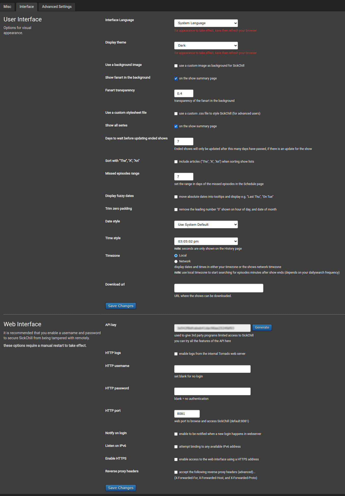

- `Interface Language:`  
  Language selection, system language or other.
- `Display theme:`  
  Currently there are 2 themes to chose from. The Dark and Light theme. Chose the theme of your preference.
- `Interface Language:`  
  Language selection, system as default.
- `Use a background image:`  
  Set your own background.
- `Show fanart in the background, Fanart transparency:`  
  Show fanart of shows in their background and their transparency.
- `Use a custom stylesheet file:`  
  Define your own stylesheet for SickChill pages.
- `Show all series:`  
  Show all episodes or only latest/last season episodes list.
- `Days to wait before updating ended shows:`  
  Number of days before show is marked as ended.??
- `Sort with "The", "A", "An":`  
  When sorting the show list on name, you can choose to remove "The", "A", "An" from the name. Personal preference.
- `Missed episodes range:`  
  Set the range in days of the missed episodes in the Coming Episode page
- `Display fuzzy dates:`  
  move absolute dates into tooltips and display e.g. "Last Thu", "On Tue"  
  `Trim zero padding`  
  Remove leading zero "0" on hours and date of month.  
  `Date style:`  
  Lets you chose the Date style for how a date should be shown. yyyy-mm-dd thursday-mm-yy etc.  
  `Time style:`  
  Use AM/PM time or 24hr.
- `Timezone:`  
  Lets you set the timezone. Display dates and times in either your timezone or the shows network timezone
- `Download url:`  
  [See here](How-to-use-Download-url)

#### Web Interface

- `API key:`  
  The API key is used by external apps like download clients to communicate with SickChill. Generate a key and add it to your preferred app.
- `HTTP logs:`  
  This enables logs from the internal Tornado web server. Let this be disabled unless ask to enable.
- `HTTP username:`  
  You can set a username and password when opening the SickChill website.
- `HTTP password:`  
  You can set a username and password when opening the SickChill website.
- `HTTP port:`  
  The port on witch SickChill accepts http connections. Make sure no other application uses this port.!
- `Notify on login:`  
  Get notified when a new login happens in webserver.
- `Listen on IPv6:`  
  Enable ipv6 support and attempt binding to any available IPv6 address.
- `Enable HTTPS:`  
  lets you enable HTTPS for secure connections.
- `HTTPS certificate:`  
  file name or path to HTTPS certificate
- `HTTPS key:`  
  file name or path to HTTPS key
- `Reverse proxy headers:`  
  ?

#### Advanced Settings

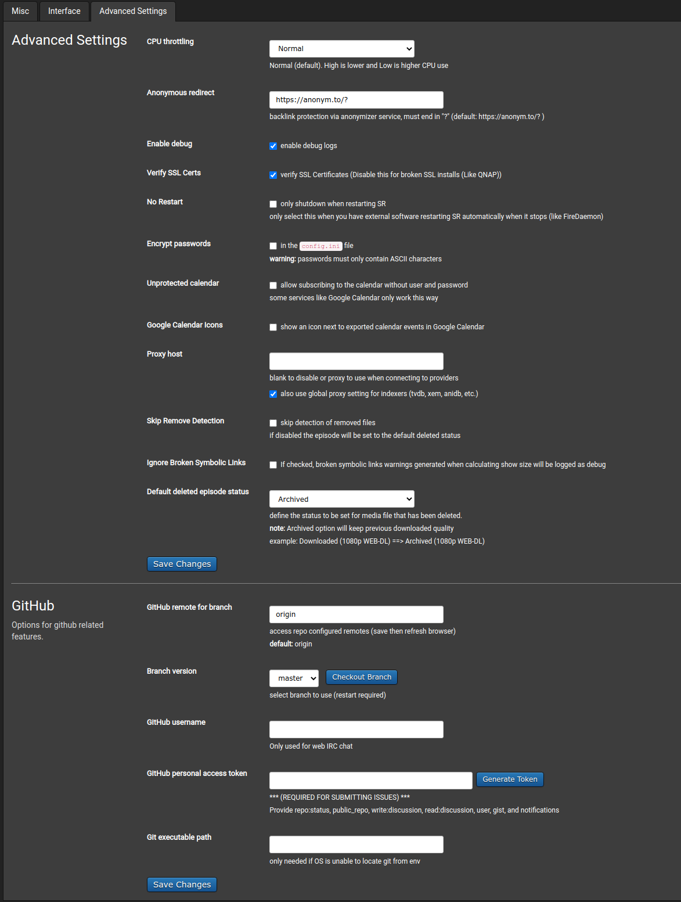

- `CPU throttling:`  
  Lets you control the CPU usage. Can be handy on low powered devices.Note : High is lower and Low is higher CPU use.
- `Anonymous redirect:`  
  Lets you set backlink protection via anonymizer service when opening a link.
- `Enable debug:`  
  Lets you enable debug logs. This gives you more log information than normal. Essential requirement for troubleshooting if you encounter an error/bug.
- `Verify SSL Certs:`  
  This feature enables the verification of SSL certificates for HTTPS etc. This should only be disabled in case of SSL errors or for testing. But first check if you have installed python correctly with pyopenssl and cryptology.
- `No Restart:`  
  Only shutdown when restarting SC. Only select this when you have external software restarting SC automatically when it stops (like FireDaemon)
- `Encrypt passwords:`  
  Lets you encrypt passwords in your config.ini file. Make sure the password only contains ASCII characters.
- `Unprotected calendar:`  
  By default the calendar is protected. This options disables the protection so that a third party app can access it. (like Google Calendar)
- `Proxy host:`  
  Let you set a Proxy to use with SickChill.
- `Default deleted episode status:`  
  Lets you set the default status of shows that have been deleted or have already been aired and not found in the folder.

#### GitHub

- `Branch version:`  
  This shows the SickChill versions you can select. Master branch is the default and the Develop branch is hidden, and can only be accessed if a GitHub account is added. Users should always use Master and only switch to Develop if asked or if they wish to assist in testing the latest edits.
- `GitHub username:`  
  Here you can add your GitHub username.
- `GitHub password:`  
  Here you can add your GitHub password.
- `GitHub remote for branch:`  
  default:origin. Access repo configured remotes (save then refresh browser)
- `Git executable path:`  
  only needed if OS is unable to locate git from env

## Backup

- This sections allows you to create a backup of your SickChill settings. The files include :
  - `sickchill.db` That contains all your shows
  - `config.ini` That contains all your settings
  - `Cache folder` That contains all your search results

- `Backup:`  
  Lets you set the backup folder where SickChill saves your backup.

- `Restore:`  
  Lets you browse and select your backup file to be restored.

## Search Settings

- This sections allows you to set all Search related settings.

#### Episode Search

- `Randomize Providers:`  
  By default SickChill searches the provider list from top to the bottom. If you enable this setting, SickChill will randomize the search order.
- `Download propers:`  
  Sometimes releases that are uploaded get "nuked" by the scene. This means there is something wrong with the file. Like it has freezes, no audio or other defects. Then a new file is released witch is called a Proper. If you enable this function SickChill will automatically search for propers of episodes you have already downloaded and snatch the proper if it finds one.
- `Check propers every:`  
  Lets you set the frequency of when Propers are searched for.
- `FlareSolverr URI:`  
  Lets you set the URL of your flaresolverr server (experimental).
- `Backlog search day(s):`  
  Lets you set the Backlog search frequency. Backlog is only used if episodes cant be found with the Daily search.
- `Daily search frequency:`  
  Lets you set the Daily search frequency. This is the main search for finding episodes. The default recommendation is 120 minutes. Don't go below 30 minutes!.
- `Cache Retention:`  
  The number of days that cached results are stored. If you use NZB's than check what the retention of your Usenet server is and add the value in this field. This prevents SickChill from sending episode NZB's that are not on your Usenet server anymore. Most paid Usenet servers have a retention above 1000 days, but ISP servers generally offer much less like 31 days.
- `Ignore words:`  
  If SickChill comes across any of those words in the title of a search result, the result will be SKIPPED. Applies to all shows. USE WITH CAUTION!
- `Prefer words:`  
  SickChill can PREFER search results with these words in the title and in the order entered. Applies to all shows. USE WITH CAUTION!
- `Require words:`  
  SickChill SKIPS/IGNORES all search results that don't have those words in the title. Applies to all shows. USE WITH CAUTION!
- `Allow high priority:`  
  This sets downloads of recently aired episodes to high priority. So those get priority over already aired episodes. Some download clients like SABnzb allow sending with high priority to prioritize downloads.
- `Use Failed Downloads:`  
  Lets you enable failed downloads. This will also allow adding bad/failed torrents/nzb to the failed.db so that they aren't downloaded again.
- `Delete Failed:`  
  Lets you enable automatic delete of left of files of Failed Downloads. Only visible if above "Use Failed Downloads" is selected.
- `Backlog search for missing only:`  
  This restricts backlog searches to missing episodes only, it also ignores episodes that are already downloaded and not a preferred quality.

#### NZB Search

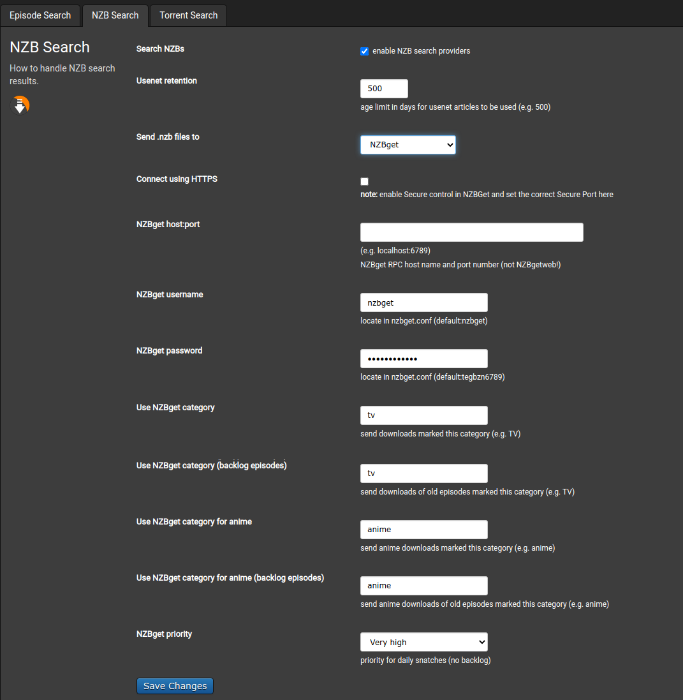

- `Search NZBs:`  
  Enable this setting if you plan to use NZB's and usenet to snatch your shows.
- `Send .nzb files to:`  
  Select you download client. Currently, the directly supported NZB clients are SABnzbd and NZBget. However, for all other clients you can use the blackhole method. With this method SickChill places the NZB in a folder of your choosing. Simply let your download client monitor that folder for new NZB files. And the download client does the rest. This makes SickChill compatible with almost every download client out there.
- `SABnzbd server URL:`  
  Add the URL where your SABnzbd client is located.
- `SABnzbd username:`  
  Add the username of SABnzbd.
- `SABnzbd password:`  
  Add the password of SABnzbd.
- `SABnzbd API key:`  
  Add the API key of SABnzbd. This allows SickChill to send the nzb directly to SABnzbd. You can find the key in your SABnzb configuration.
- `Use SABnzbd category:`  
  Set the category that SABnzbd uses for tv shows. Default is TV.
- `Use SABnzbd category for anime:`  
  Set the category that SABnzbd uses for anime shows. Default is anime.
- `Use forced priority:`  
  enable to change priority from HIGH to FORCED. This allows NZBs to even start when SABnzbd is Paused.

#### Torrent Search

- This sections allows you to set the torrent download client.

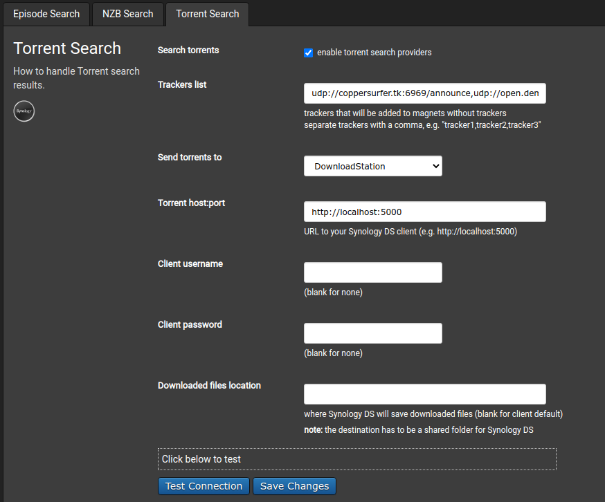

- `Search torrents:`  
  Enable this function to download yous shows with Torrents.
- `Send .torrent files to:`  
  This allows you to set the direct torrent download clients. Currently supported are. : uTorrent, Transmission, Deluge, Synology Download Station, rTorrent QBittorrent. Also, the blackhole method is supported, so that almost every Torrent download client is supported.
- `Synology DS host:port:`  
  Add the address and port of Synology Download Station.
- `Synology DS username:`  
  The username of the Synology account. (best to use the admin account to prevent permission issues.)
- `Synology DS password:`  
  The password of the Synology account.
- `Downloaded files location:`  
  Here you can set a manual download location. If blank the default Download Station folder is used.

## Search Providers

- This sections allows you to set up your Search Providers

#### Provider Priorities

This sections allows you to enable/disable the providers you want to use and drag&drop them in the order you like them to be searched. Al-trough SickChill has already a large number of build-in providers it can be that your favorite provider is not yet added. Don't worry, SickChill has the possibility to add almost every NZB/Torrent provider that is out there. This can be done by adding a Custom provider. Especially for NZB providers it's better to set them up manually, that gives you the most flexibility and efficiency while searching. For more information see the explanations below. Click for [Jackett specific guide](https://github.com/SickChill/SickChill.WikiTemp/blob/main/Settings-jackett).

#### Build-in NZB (and Custom) Providers

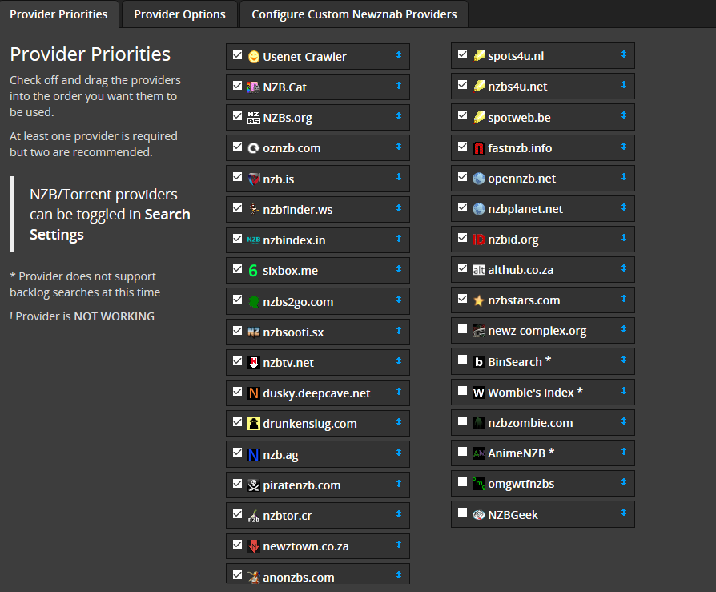

#### Build-in Torrent providers (as of Juli 2015)

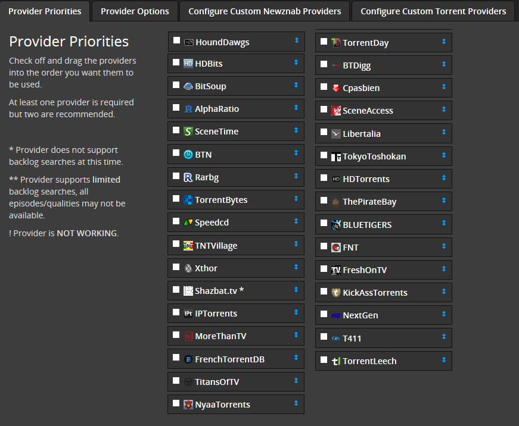

#### Provider Options

- This sections allows you to configure the providers.

- `Configure provider:`  
  Those the provider you want to modify. (only enabled providers are shown in the list.)
- `URL:`  
  The url of the provider.
- `API key:`  
  Add here the API key that the provider has supplied you with.
- `Enable daily searches:`  
  Do you want to enable daily searches for this provider.?
- `Enable backlog searches:`  
  Do you want to enable backlog searches for this provider.?
- `Season search fallback:`  
  Do you only want to search season packs with this provider.?
- `Season search mode:`  
  Do you only want to search episodes packs with this provider.?

#### Configure Custom Newznab Providers

- SickChill lets you add almost every NZB Indexer out there. The custom Newznab is the preferred way of adding an NZB indexer. You might ask yourself if it's not better to build them in? Well it's not... Firstly there are so many NZB indexers out there that it is impossible to add them all. But even a better reason is that you can search far more efficient if you add/configure the indexer manually. An indexer uses category's to search. Generally they are divided between SD, HD, Sports, Anime etc. Now lets say you only need HD releases than there is no point in adding/enabling all the others. Same if you only need Sports. This method is far more efficient than building-in a provider and using all the category's by default. Click for [Jackett specific guide](https://github.com/SickChill/SickChill.WikiTemp/blob/main/Settings-jackett).

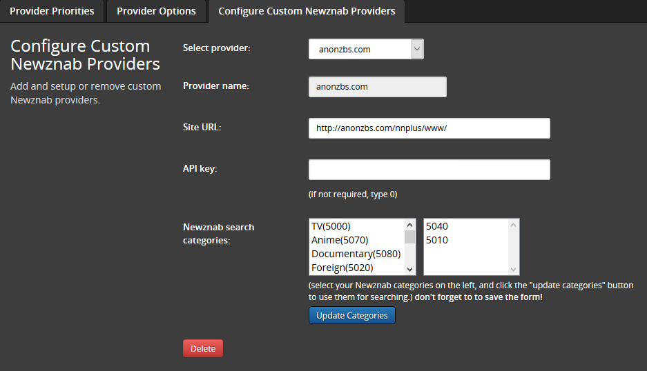

- `Select provider:`  
  Here you can add a new custom newznab provider by selecting --add new provider-- or modify an already added custom provider.
- `Provider name:`  
  Here you can add the name of the provider. You can freely name it, but if you like to get a provider icon infront of the provider name than use naming like oznzb or oznzb.com as the icons are named this way.
- `Site URL:`  
  The providers URL. Try to use HTTPS for better security if the providers allows it, otherwise HTTP.
- `API key:`  
  Fill in your API key that your provider has provided you with.
- `Newznab search categories:`  
  Here you can add the categories for your provider. For regular users the categories 5030 (SD) 5040 (HD) and when available 5010 (WEB-DL) are the most important ones. If you only download SD quality shows than only add the category 5030 (SD). No need to add 5040 (HD) & 5010 (WEB-DL) than. This makes searching way more efficient. There is also a category 5000 (TV) however this contains all TV related shows like anime, foreign, sports, shows, documentary, etc. Lots of witch you probably don't need, and therefor not very efficient to search. In case you are using sports you need to add the category 5060 (Sport) and when you use Anime shows add the category 5070 (Anime).  
  Note, some NZB indexers use a different numbering scheme, but you should be able to navigate your way through.

#### Configure Custom Torrent Providers

- SickChill let you add Torrent providers that are currently not build-in yet. The only requirement is that the Torrent site has an RSS feed. Most of them do, and some let you even customize the feed so only the results you want are added. This makes it very efficient and quick to search.

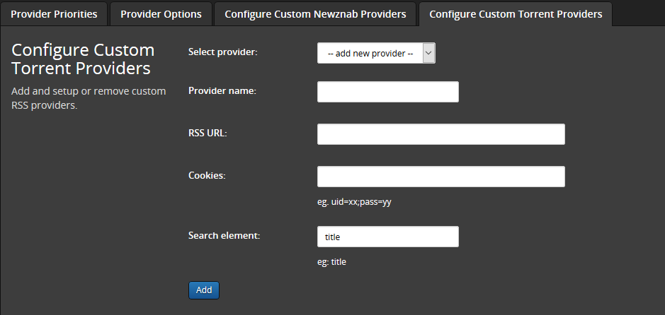

- `Select Provider:`  
  Lets you select and add a custom torrent provider.
- `Provider name:`  
  Lets you set a name for the provider.
- `RSS Url:`  
  Set here the RSS URL that you have received from the provider.
- `Cookies:`  
  Here you need to set the settings that are normally included in a cookie. Examples are user-name and password.
- `search element:`  
  ?

## Subtitles Search

- This section lets you set up automatic subtitle downloads.

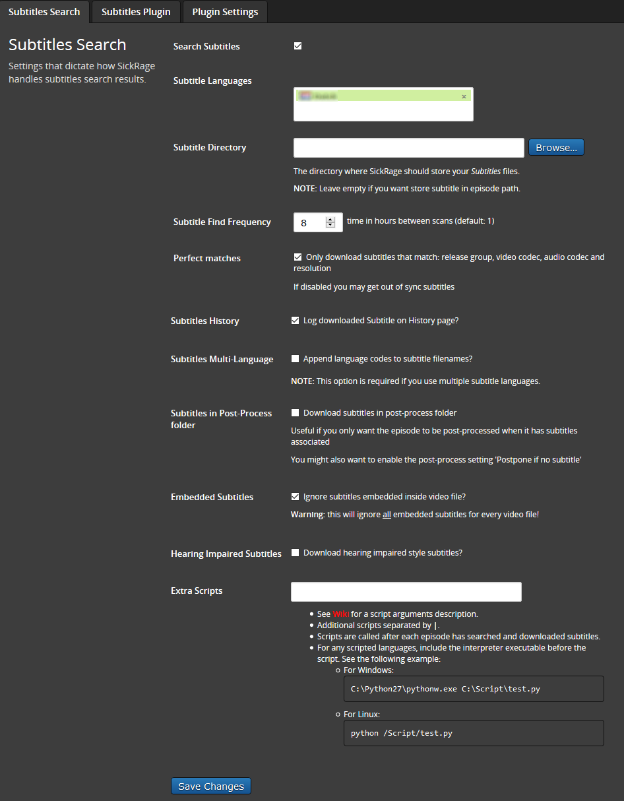

- `Search Subtitles:`  
  Enable if you want SickChill to search and download subtitles.
- `Subtitle Languages:`  
  Add here the subtitle languages you like SickChill to search.
- `Subtitle Directory:`  
  By default SickChill places the subtitles in your shows' folder. With this setting you can store them all in one folder.
- `Subtitle Find Frequency:`  
  Set how frequent SickChill should search for subtitles in hours.
- `Subtitles History:`  
  Enable if you like to see an entry on the history page if a subtitle is downloaded.
- `Subtitles Multi-Language:`  
  Some media players don't support language codes behind the subtitles like Game of Thrones S01E01_EN.srt If that is the case disable this setting and the subtitles will be named without the \_EN addition.
- `Embedded Subtitles:`  
  MKV episodes can have build-in subtitles. If you want to ignore those enable this setting so SickChill can search for subtitles itself.
- `Extra Scripts:`  
  This allows you to run a script after a subtitle was downloaded. Can be useful if you want to insert the subtitle into an MKV file etc.

#### Subtitle Plugins

- Here you can enable the preferred subtitle providers where SickChill should search for subtitles.

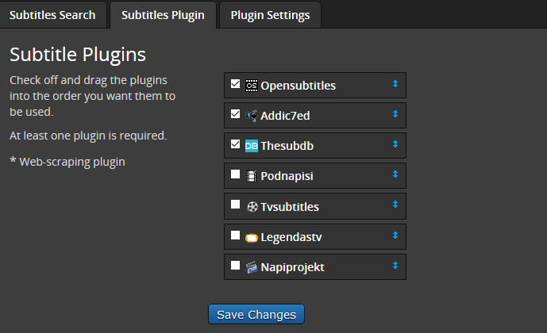

#### Plugin Settings

- Some subtitle providers have the ability to use an account for extra functions or removing limitations. Here you can add your account details.

## Post Processing

- In this section you can use post process options that SickChill should preform after an episode is downloaded. For example renaming of the file etc. More information can also be found under [Post Processing](Post-Processing)

- `Enable:`  
  Select this to allow SC to do post processing.
- `Post Processing Dir:`  
  This is the folder that SickChill monitors for newly downloaded files/episodes. Once a new file is found the post-processing starts to move the file to your shows folder and take any other actions that you have configured.
- `Process Method:`  
  Lets you select what method should be used to move the file to your shows' folder. Move is the most used method, but the more advanced [hard linking](https://en.wikipedia.org/wiki/Hard_link) is recommended in case you want to seed the file with your torrent client.
- `Auto Post-Processing Frequency:`  
  Set the frequency, in minutes, that the folder is checked for files to process. Don't go below 10 minutes as that may cause detection problems. It can happen that the next scan starts when the previous scan is still moving a file. You will receive errors that the file/folder doesn't exist etc.
- `Postpone post processing:`  
  Wait if sync files are present in folder. This prevents post processing from starting and prevents errors or incomplete files. However, its strongly recommended that you set up your download client to use a separate (temp) folder for files that are still being downloaded, and that only completed files are moved to the TV Download Dir that SickChill monitors.
- `Sync File Extensions:`  
  List of sync files to postpone processing if present in folder.
- `Rename Episodes:`  
  Set to rename episodes using the Episode Naming settings.
- `Create missing show directories:`  
  Set to create missing show directories when they get deleted or don't exist.
- `Add shows without directory:`  
  Lets you add shows without creating a directory (not recommended)
- `Move Associated Files:`  
  Set to have SickChill move any files that are downloaded with the episode file like external subtitles etc. to the same location.
- `Rename .nfo file:`  
  In case there is already a .nfo file in the show folder SickChill will rename it to .nfo-org to prevent if from being overwritten and causing conflicts.
- `Associated file extensions:`  
  Here you can set the extensions SickChill should keep and post processing with the episode file.
- `Delete non associated files:`  
  Let SC delete non associated files while post processing.
- `Change File Date:`  
  Set last modified file date to the date that the episode aired. May not work on some systems.
- `Timezone for File Date:`  
  Set the timezone for setting file date.
- `Unpack, Unpack Directory:`  
  In case a rar collection is detected in the Post Processing Dir, SickChill can unrar them to _Unpack Directory_.
- `Unrar Location, Unar Tool:`  
  Add the path to unrar and path to an unrar tool if they are not in the system path.
- `Delete RAR contents`
  Delete the contents of RAR files, even if Process Method not set to move, only works with RAR archives.
- `Follow symbolic-links`
  Enable SC to follow down symbolic links in download directory?
  warning: Enable only if you know what circular symbolic links are, and can verify that you have none. EXPERTS ONLY.
- `Use Failed Downloads:`  
  Lets you enable failed downloads. This gives you the opportunity to mark a nzb/torrent as failed and added to the failed.db, so that the same isn't downloaded again.
- `Use icacls:`  
  Sets video file permissions after using the move method in post processing. _Windows only_.
- `Extra Scripts:`  
  SickChill gives you the opportunity to run your own scripts for post-processing. See [post processing](Post-Processing) for more information.

#### Episode Naming

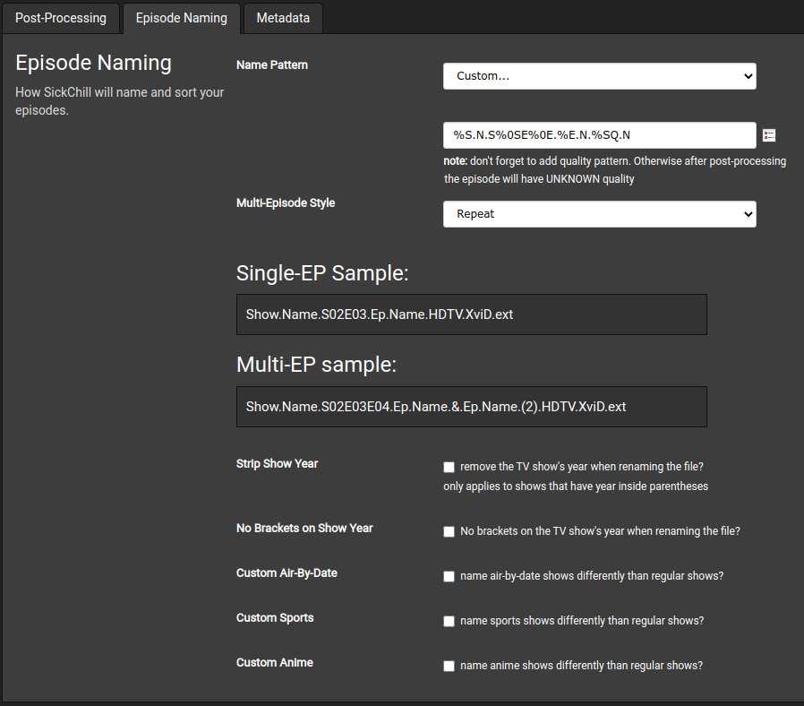

- `Name Pattern:`  
  Lets you set pre-configured renaming schemes or your own custom one. The _Toggle naming legend_ list button provides a list of parameters that can be used.
- `Multi-Episode Style:`  
  Choose naming parameter for files which have multiple episodes.
- `Strip Show Year:`  
  Remove the _year_ of the show if it exists.
- `No Brackets on Show Year:`  
  Set to remove brackets on the TV show's year when renaming the file. Default has brackets.
- `Custom Air-By-Date:`  
  Name Air-By-Date shows differently than regular shows
- `Custom Sports:`  
  Name Sports shows differently than regular shows
- `Custom Anime:`  
  Name Anime shows differently than regular shows

#### Metadata

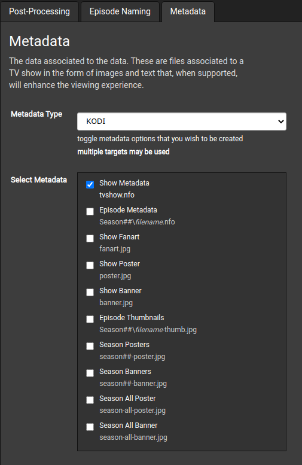

- `Metadata Type:`  
  Select from the multiple types of metadata.
- `Select Metadata:`  
  Select metadata to keep in series folder.

Recommend `Show Metadata` be selected as if your database gets corrupted the rebuilding process of `Add existing shows` will use this file and not need to search and select individually.

## Notifications

- SickChill lets you send notifications to your favorite home Theater/NAS, Devices or Social media service.

#### Home Theater/NAS

- `KODI`
  A free and open source cross-platform media center and home entertainment system software with a 10-foot user interface designed for the living-room TV.
- `Plex Media Server:`  
  Experience your media on a visually stunning, easy to use interface on your Mac connected to your TV. Your media library has never looked this good!
- `Plex Home Theater:`
- `Emby:`  
  Bringing all of your media together into one place has never been easier. Your Emby Server automatically converts and streams your media on-the-fly to play on any device.
- `NMJ:`  
  A home media server built using other popular open source technologies.  
  The Networked Media Jukebox, or NMJ, is the official media jukebox interface made available for the Popcorn Hour 200-series.
- `NMJv2:`  
  The Networked Media Jukebox, or NMJv2, is the official media jukebox interface made available for the Popcorn Hour 300 & 400-series.
- `Synology:`  
  The Synology DiskStation NAS. Synology Indexer is the daemon running on the Synology NAS to build its media database.
- `Synology Notifier:`  
  Synology Notifier is the notification system of Synology DSM (DSM6 only).
- `pyTivo:`  
  pyTivo is both an HMO and GoBack server. This notifier will load the completed downloads to your Tivo.

#### Devices

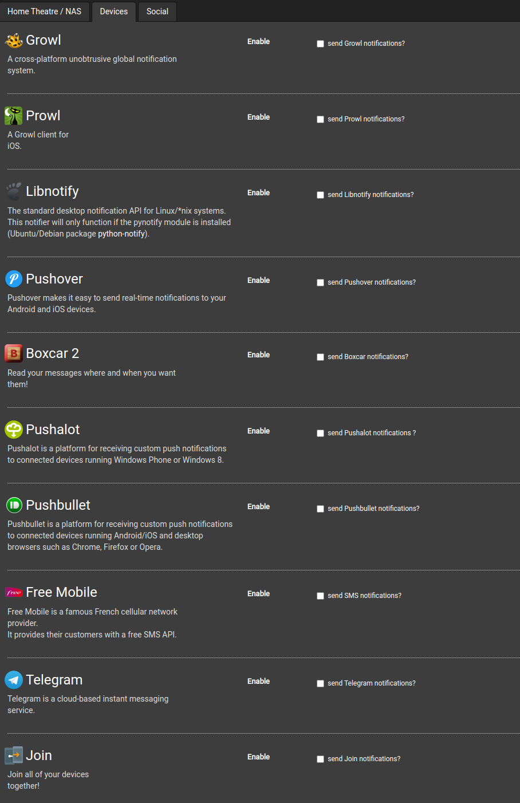

- `Growl:`  
  A cross-platform unobtrusive global notification system.
- `Prowl:`  
  A Growl client for iOS.
- `Libnotify:`  
  The standard desktop notification API for Linux/\*nix systems. This notifier will only function if the pynotify module is installed (Ubuntu/Debian package python-notify).
- `Pushover:`  
  Pushover makes it easy to send real-time notifications to your Android and iOS devices.
- `Boxcar:`  
  Universal push notification for iOS. Read your messages where and when you want them! A subscription will be sent if needed.
- `Boxcar2:`  
  Read your messages where and when you want them!
- `Notify My Android:`  
  Notify My Android is a Prowl-like Android App and API that offers an easy way to send notifications from your application directly to your Android device.
- `Pushalot:`  
  Pushalot is a platform for receiving custom push notifications to connected devices running Windows Phone or Windows 8.
- `Pushbullet:`  
  Pushbullet is a platform for receiving custom push notifications to connected devices running Android and desktop Chrome browsers.
- `Free Mobile:`  
  Free Mobile is a famous French cellular network provider.
  It provides to their customer a free SMS API.
- `Telegram:`  
  Telegram cloud messaging.
- `Join:`  
  Join, sync across your devices.

#### Social

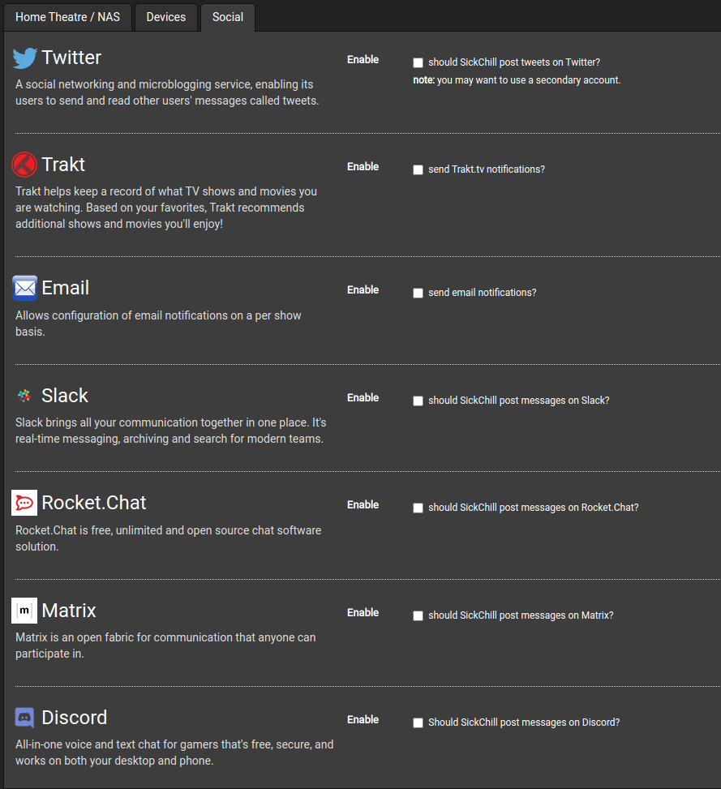

- `Twitter:`  
  A social networking and micro-blogging service, enabling its users to send and read other users' messages called tweets.
- `Trakt:`  
  trakt helps keep a record of what TV shows and movies you are watching. Based on your favorites, trakt recommends additional shows and movies you'll enjoy!
- `Email:`  
  Allows configuration of email notifications on a per-show basis.  
  Note: If using gmail, and having this error `"ERROR: SMTP AUTH extension not supported by server."` , please enable this https://www.google.com/settings/security/lesssecureapps & try settings : smtp.gmail.com , port 587 , TLS , myemail.email@gmail.com , password.
- `Slack:`  
  Slack brings all your team's communication together in one place, real-time messaging, archiving and search.
- `Rocket.Chat:`  
  Rocket.Chat is free, unlimited and open source chat software solution.
- `Matrix:`  
  Matrix is an open fabric for communication that anyone can participate in.
- `Discord:`  
  All-in-one voice and text chat for gamers that's free, secure, and works on both your desktop and phone.

## Anime

#### AnimeDB Settings

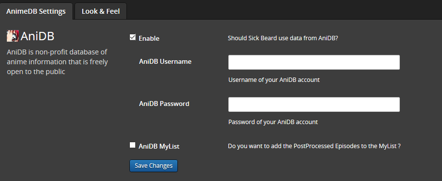

- `Enable:`  
  Lets you enable the AniDB function/indexer
- `AniDB Username:`  
  Lets you set the AniDB Username
- `AniDB Password:`  
  Lets you set the AniDB Password
- `AniDB MyList:`  
  Do you want to add the Post Processed Episodes to the MyList ?

#### Look & Feel

- `Split show lists:`  
  Separate anime and normal shows in groups
