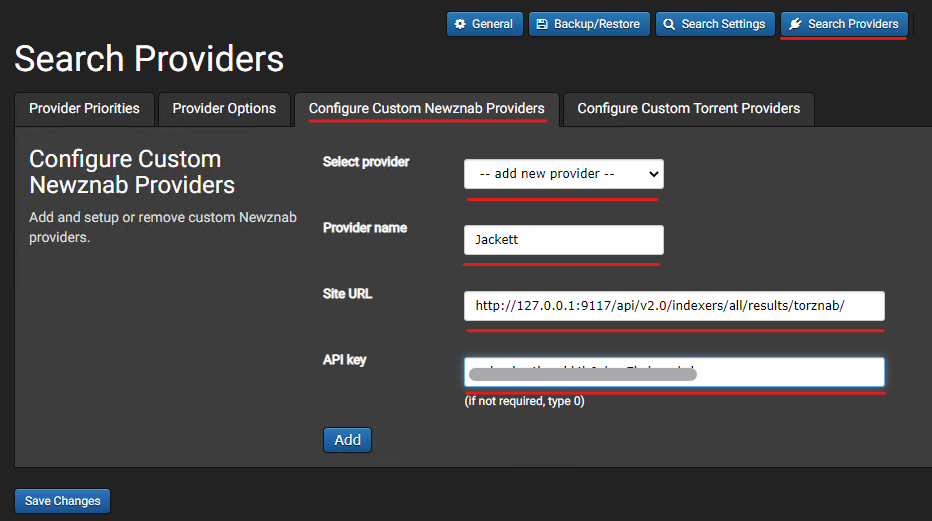

# **How to use Jackett with SickChill**

1. Go to [https://github.com/Jackett/Jackett](https://github.com/Jackett/Jackett) and look for the installation instructions and download for your OS of choice.  
   a. Make sure to install Jackett as a service.  
   b. Once the installation is finished, Navigate your web browser to [http://127.0.0.1:9117](http://127.0.0.1:9117/)
2. Begin by adding some trackers of your favorite or interesting providers by clicking on the **Add Indexer** button located towards the top.  
     
   **Note** : For your 1st time, filter by **public** and **en-US** trackers.
3. Add individual trackers by clicking the **blue wrench** button. This will open another box displaying the site details as well as all the categories that will be available through that tracker. Click the **Okay** button to finish adding the tracker to Jackett.  
   

     
   **Note** : Semi-private and private trackers will have additional details like cookies, usernames and/or passwords as well as site-specific API keys to use their trackers. If you don't have these details, don't add those trackers.

4. The tracker you added should now show up under your Jackett main window, Configured Indexers. You will want to click **Test** and verify Jackett reports successfully if it can communicate with the tracker. A green check indicates successful communication.
   
5. We are now ready to go over to SickChill and add Jackett. Leave Jackett open as we will need to click the **Copy Torznab Feed** button highlighted up top to copy the URL SickChill needs to our clipboard. We need to modify this URL Jackett gives us just a bit to take FULL advantage of Jackett.  
   **Note** : For easy reference, if you have Jackett installed on the same computer as SickChill, you can refer to the below for your provider site URL:  
   [**http://127.0.0.1:9117/api/v2.0/indexers/all/results/torznab/**](http://127.0.0.1:9117/api/v2.0/indexers/all/results/torznab/)  
   **IMPORTANT** : The key difference is we replaced the tracker specific directory in the URL with the keyword "all" - This ensures Jackett will provide SickChill ALL your trackers' results instead of just the one you copied the URL from.
6. We also need the API key listed in the upper right hand corner of Jackett as so. You can click to copy that to your clipboard when needed as well:  
   
7. Navigate to your SickChill **Search Settings** , by clicking the **gears** icon in the upper right hand corner, then click on the **NZB Search** tab.
8. Check the box to **enable NZB search providers**. Leave default 500 for retention and Black hole for Send .nzb files to.
9. Set the **black hole folder location** to your directory where your torrent client downloads to. **Note** : This directory setting is not necessary for Jackett to work as long as SickChill is configured to communicate to your download client (qbittorrent, etc), but previous tutorials suggested setting this directory.  
     
   Make sure to click **Save Changes**!  
   **IMPORTANT** : It is assumed your SickChill application is already configured to communicate with your download client such as qbittorent, utorrent, deluge, etc.) If you haven't done so, please visit [Settings-explained](Settings-explained.md) and scroll down to the section on Torrent Search.
10. Now click on the **Search Providers** pill link on the navigation bar of SickChill and go to the (newly added if NZB wasn't previously enabled in SC) **Configure Custom Newsnab Provider** and click the drop-down to **- - add new provider - -**
11. Set the provider name as **Jackett**.
12. Go back to Jackett and copy the **Torznab Feed** url. **IMPORTANT** : If you copy from Jackett, we need to replace a part of the URL path with the "all" keyword instead of the tracker specific name you copied from. This ensures this one provider in SC will search ALL your providers in Jackett. Refer to the image below.  
      
    For clarification purposes, if you have Jackett and SickChill installed on the same computer you can just copy and paste the below into your site URL for a hassle-free setup.  
    `http://127.0.0.1:9117/api/v2.0/indexers/all/results/torznab/`
13. Now go and copy the **Jackett API** to your clipboard in the upper right hand corner of Jackett and paste that into the API key in the SC box accordingly.
14. Click **Add**. Now the categories will appear. Either individually select categories you want SC to search in Jackett by holding down Ctrl + click. Or just click in the box and select all (Ctrl+A) and click **Update Categories**. You should see the numerical category populate in the right side box for every category you successfully added.
15. Click to **Save Changes**!
16. Now go to the **Provider Priorities** tab in SC and select your newly added provider from the drop-down.
17. Your new provider you added should be at the bottom of the list. Click and drag him up to the top.  
    
18. Now click on the **Provider Options** tab and select your newly added provider Jackett from the drop-down list and check both **enable daily searches** and **enable backlog searches** and any other settings displayed on this screen.
19. Click to **Save Changes**!
20. You are all done!
21. To test and ensure you are operational. Go to SickChill and manually search for an episode. Visit the logs in SC and ensure you see a search kick off named under your newly added provider name:
    > 2023-06-03 23:15:06 INFO :: SEARCHQUEUE-MANUAL-353546 :: [Jackett (ALL)] :: Performing episode search for \<show_name\> (\<year\>)
22. Go over to the Jackett UI and click on **view logs** under the Jackett Configuration, you should see your SC search request details in the log and whether Jackett found relevant releases that match:  
      
    If you have any issues at this point, simply jump over to the SickChill discord chat for some friendly support by visiting [https://discord.gg/FXre9qkHwE](https://discord.gg/FXre9qkHwE)
