---

[ [Add Show button] ](#add-show-button) [ [Shows overview and buttons explained] ](#shows-overview-and-buttons-explained) [ [Shows Edit Button] ](#shows-edit-button)

---

## Add Show button

- This button allows you to add a new or existing shows.

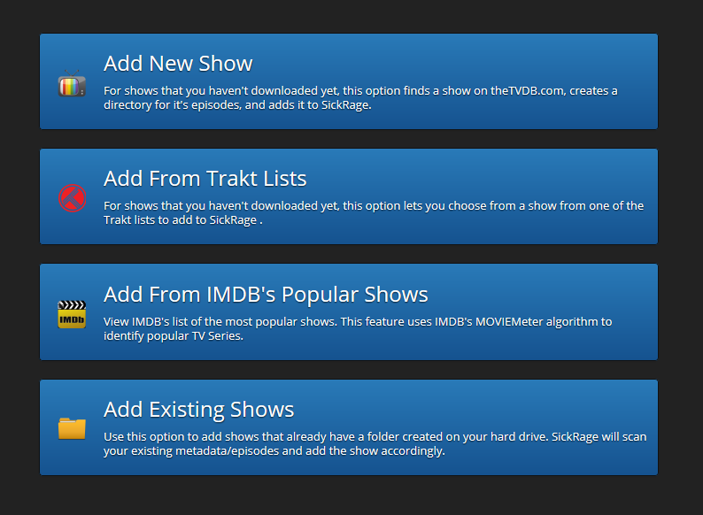

#### Adding a new Show

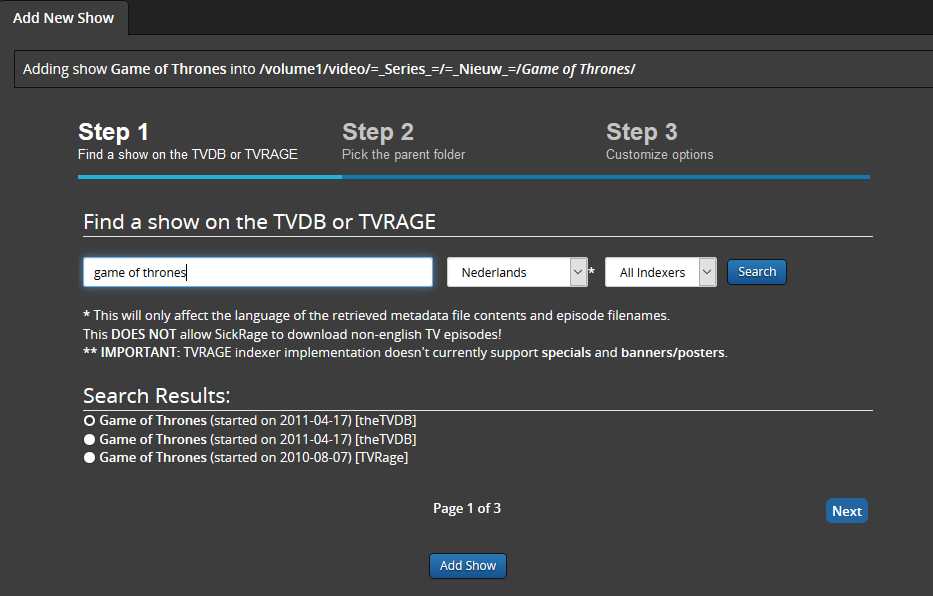

_Step 1_

Once you clicked on the new show button you will be asked to enter the name of the show you like to search/add. In this example "game of thrones". Further you can set a language that you want to use for the show, like descriptions etc. And last the preferred indexer where SickChill should search. When you are ready push search. Now any results found will be showed in the lower part of the screen. Select the show you want end click `next`. (Alternatively you can click on the `add` button, however this will skip the customization settings.!)

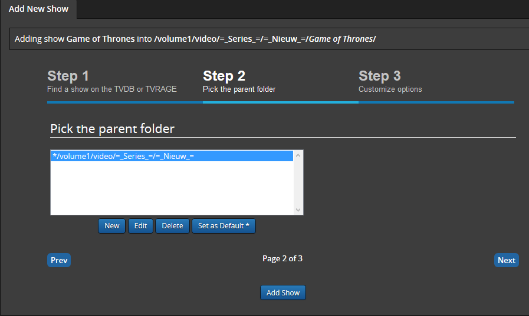

_Step 2_

Now that we have selected the show we are actually going to add it.
In case you have not set a Root folder yet, (the folder where you want to place your shows) use the `new` button to add one. And again press `next`

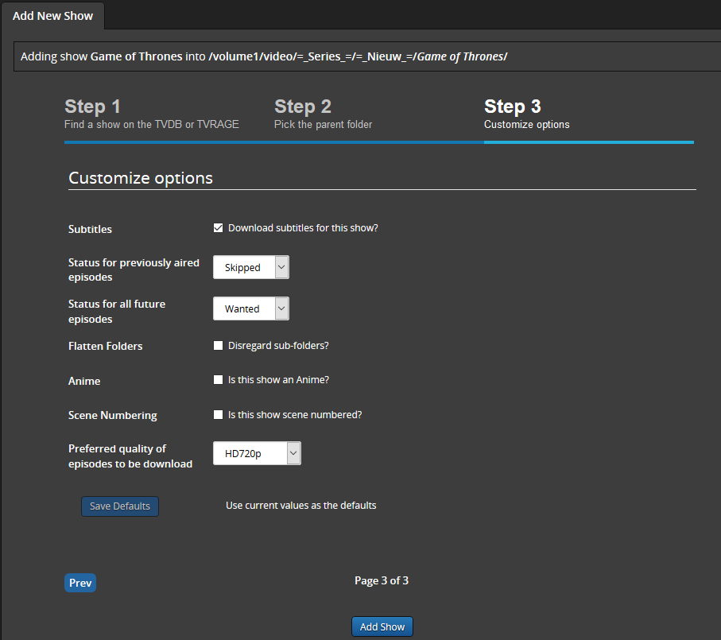

_Step 3_

Here you have the possibility to customize the shows settings.

- `Subtitles`  
  Should subtitles be enabled for this show. Allows SickChill to search for subtitles.
- `Status for previously aired episodes`  
  What status should be set for episodes that have already been aired.?
- `Status for all future aired episodes`  
  What status should be set for episodes that have NOT yet aired.? (Set Wanted or no newly aired episodes will be downloaded!)
- `Flatten Folders`
- `Anime`  
  Is this an Anime show and should SickChill use Anime functions.?
- `Scene Numbering`  
  Should SickChill use [Scene Numbering](Scene-exceptions-and-numbering.md#what-is-scene-numbering).?
- `Preferred quality of episodes to be downloaded`  
  What [quality](Quality-Settings.md) should SickChill use.?
- `Save Defaults`  
  This allows the settings you have selected to be saved as defaults, So you don't have to manually select them next time adding a show.  
  Now that you have set up all settings press the `add` button.

#### Add popular IMDB shows

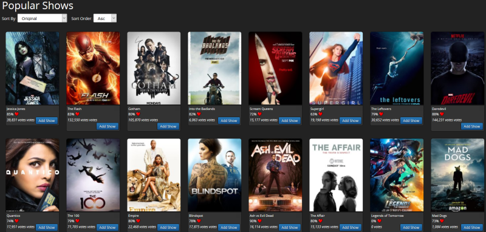

This nice feature gives you an overview of the current popular/trending TV shows on [IMDB](http://www.imdb.com/) and lets you add them. It uses the IMDB MOVIE meter Rating system, that ensures reliably results. Give it a try, and learn the shows you should consider adding. Shows that already are in your list will be hidden.

#### Add popular Trakt shows

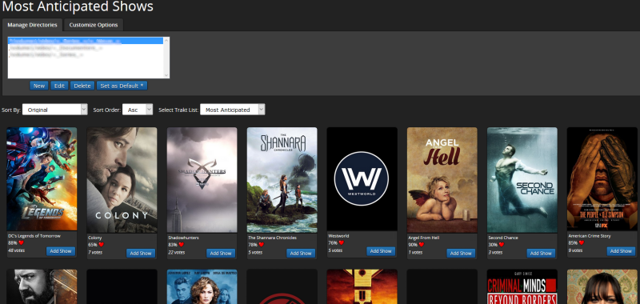

Similar to the IMDB popular shows option, here you can add Trending shows from [Trakt](https://trakt.tv/).

#### Adding an existing show

- SickChill also has the ability to add existing shows. Unlike newly added shows an existing show has already a folder with the episodes and/or metadata present.

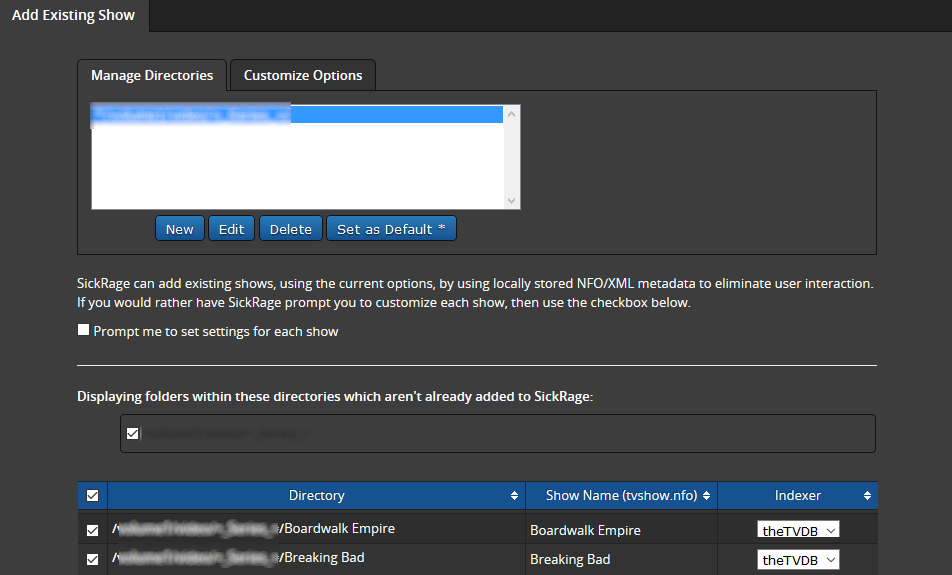

Adding an existing show basically works the same as a new show. The main difference is that you need to select the folder where the show is located. Set/add the root folder where the show(s) are located and SickChill will give an overview of all the (not yet used) folders and allow you to set an indexer to search. You can add multiple shows at once or just one singe show.

In case you are using meta-data/nfo files and have the tvshow.nfo file in a series folder, the adding process will go automatically.

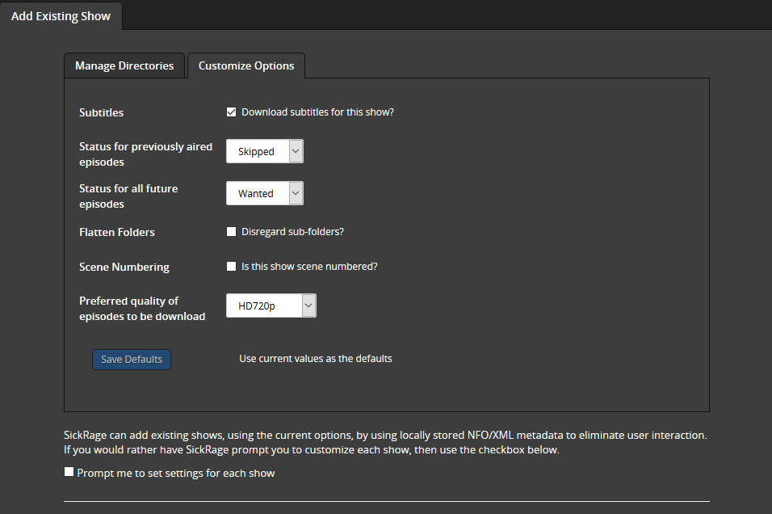

Just as adding a new show you can set custom settings for the show(s). If you like to set every show manually than enable the option `prompt me to set settings for each show` :

- `Subtitles`  
  Should subtitles be enabled for this show. Allows SickChill to search for subtitles.
- `Status for previously aired episodes`  
  What status should be set for episodes that have already been aired.?
- `Status for all future aired episodes`  
  What status should be set for episodes that have NOT yet aired.? (Set Wanted or no newly aired episodes will be downloaded!)
- `Flatten Folders`
- `Anime`  
  Is this an Anime show and should SickChill use Anime functions.?
- `Scene Numbering`  
  Should SickChill use [Scene Numbering](Scene-exceptions-and-numbering.md#what-is-scene-numbering).?
- `Preferred quality of episodes to be downloaded`  
  What [quality](Quality-Settings.md) should SickChill use.?
- `Save Defaults`  
  This allows the settings you have selected to be saved as defaults, So you don't have to manually select them next time adding a show.  
  Now that you have set up all settings press the `add` button.

## Shows overview and buttons explained

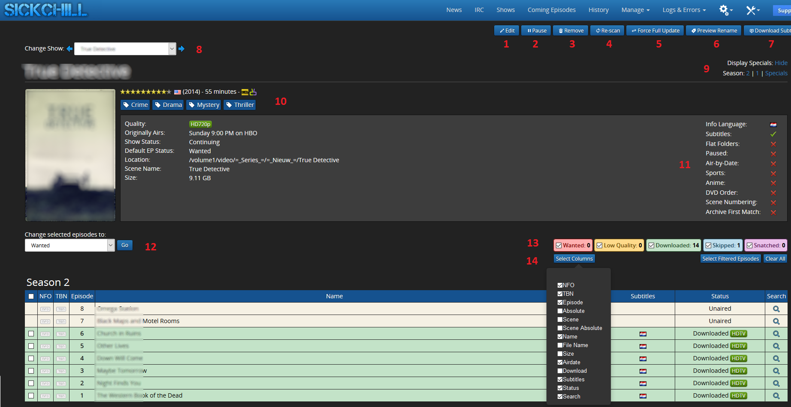

1 `Edit:`
Opens the edit section of the show. Here you can specify your settings for this show.  
2 `Pause:`
This will Pause/Resume your show. If paused no newly aired episodes will be downloaded.  
3 `Remove:`
Lets you remove the show from SickChill. When pushed you will get a pop-up screen with the question to remove the show with or without the file/folder.  
4 `Re-Scan:`
Rescans all the files in your shows folder. Episodes,subtitles and metadata. etc.  
5 `Force-Full Update:`
Forces a full update of your shows data from the indexer. Replaces the old data in the database. Can be helpful in case you have problems with air dates, metadata etc.  
6 `Preview Rename:`
Opens the Preview Rename page. It allows you to see how the files will look after the rename, if you have set up renaming in post-processing.  
7 `Download Subtitles:`
Starts an automatic search for missing subtitles for the show.  
8 `Change Show:`  
This settling lets you quickly navigate between shows without returning to the main page.  
9 `Display Specials:`
Lets you hide specials from the page.  
9 `Seasons:`
Lets you quick jump to the selected season.  
10 `Summery:`
Summery of the show. This includes : Name, IMDB score, production country/year, links to indexer/IMDB/XEM, genre, Quality, airtime, Show Status, default EP Status, file path, Scene Name, Size.  
11 `Setting overview:`
Gives a quick overview of the most important settings that are in use for the show.  
12 `Change selected episodes to:`  
Lets you set individual episodes to your preferred status.  
13 `Status check-boxes:`
Lets you select what episodes should be showed with what status.  
14 `select columns:`
This lets you customize the columns of the seasons. You can add the size columns or the filename columns etc. The columns that can be set are:  
&nbsp;&nbsp;&nbsp;&nbsp;&nbsp;&nbsp;`NFO:` Shows if a [\*.nfo](http://kodi.wiki/view/NFO_files/tvepisodes) is present for the episode in the folder.  
&nbsp;&nbsp;&nbsp;&nbsp;&nbsp;&nbsp;`TBN:` Shows if there are covers, banner, posters, thumbnails, or fanart in the folder.  
&nbsp;&nbsp;&nbsp;&nbsp;&nbsp;&nbsp;`Episode:` Shows the episode number supplied by the indexer.  
&nbsp;&nbsp;&nbsp;&nbsp;&nbsp;&nbsp;`Absolute:` Shows the Absolute supplied by the indexer.  
&nbsp;&nbsp;&nbsp;&nbsp;&nbsp;&nbsp;`Scene:` Adds a field to manually enter a scene number.  
&nbsp;&nbsp;&nbsp;&nbsp;&nbsp;&nbsp;`Scene Absolute:` Adds a field to manually enter a scene absolute number.  
&nbsp;&nbsp;&nbsp;&nbsp;&nbsp;&nbsp;`Name:` Shows the episode name supplied by the indexer.  
&nbsp;&nbsp;&nbsp;&nbsp;&nbsp;&nbsp;`File name:` Shows the file name of the episode.  
&nbsp;&nbsp;&nbsp;&nbsp;&nbsp;&nbsp;`Size:` Shows the size of the episode file.  
&nbsp;&nbsp;&nbsp;&nbsp;&nbsp;&nbsp;`Airdate:` Shows the air-date of the episode.  
&nbsp;&nbsp;&nbsp;&nbsp;&nbsp;&nbsp;`Download:`  
&nbsp;&nbsp;&nbsp;&nbsp;&nbsp;&nbsp;`Subtitles:` Shows the subtitles that are downloaded with a small flag.  
&nbsp;&nbsp;&nbsp;&nbsp;&nbsp;&nbsp;`Status:` Shows the status of the episode. (wanted,skipped, downloaded HDTV etc.)  
&nbsp;&nbsp;&nbsp;&nbsp;&nbsp;&nbsp;`Search:` By clicking on the search glass you can manually search for an episode.

## Shows Edit Button

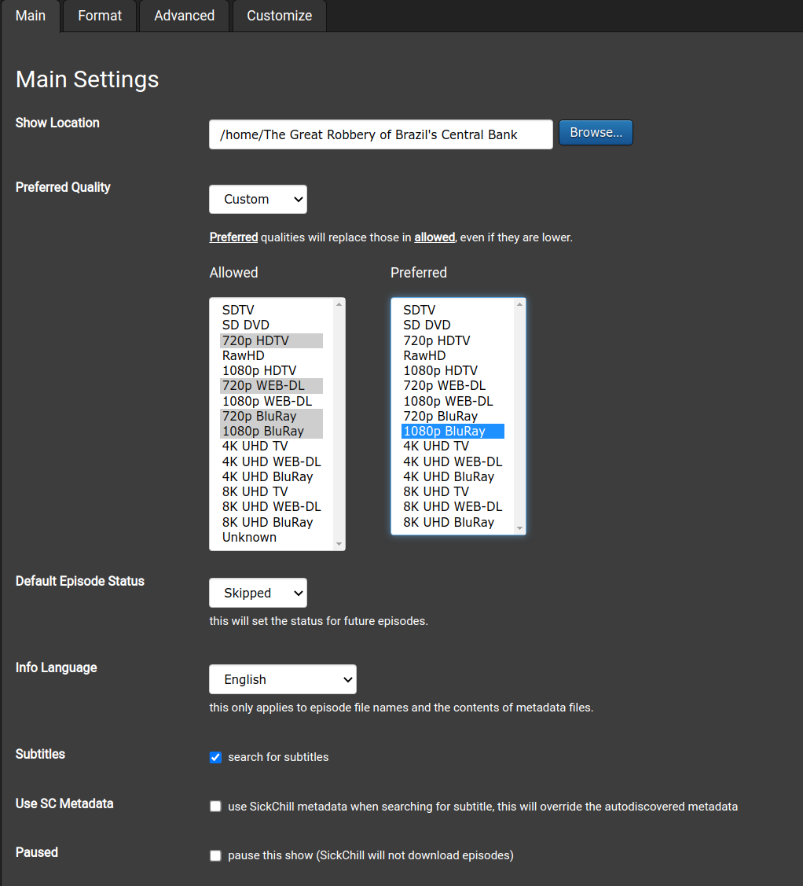

#### Main Settings

- `Show Location:`  
  Lets you set the location of the shows folder.
- `Preferred Quality:`  
  Lets you set the quality of the file that SickChill should download. See [Quality Settings](Quality-Settings.md) for more info.
- `Default Episode Status:`  
  Lets you set the Default Episode Status. Needs to be set to WANTED if you want new shows to be downloaded.! See [Default Episode Status](FAQ%27s-and-Fixes.md#newly-aired-shows-are-not-downloading-and-set-to-skippedignored) for more info.
- `Info Language:`  
  Lets you set the default language for the show. Info, descriptions etc. Note, not subtitles.!
- `Subtitles:` Enable or disable the automatic download of subtitles for this show.
- `Use SC Metadata:` To use SickChill metadata when searching for subtitle, this overrides the auto discovered metadata.
- `Paused:` Lets you pause the show. Prevents show from being downloaded.

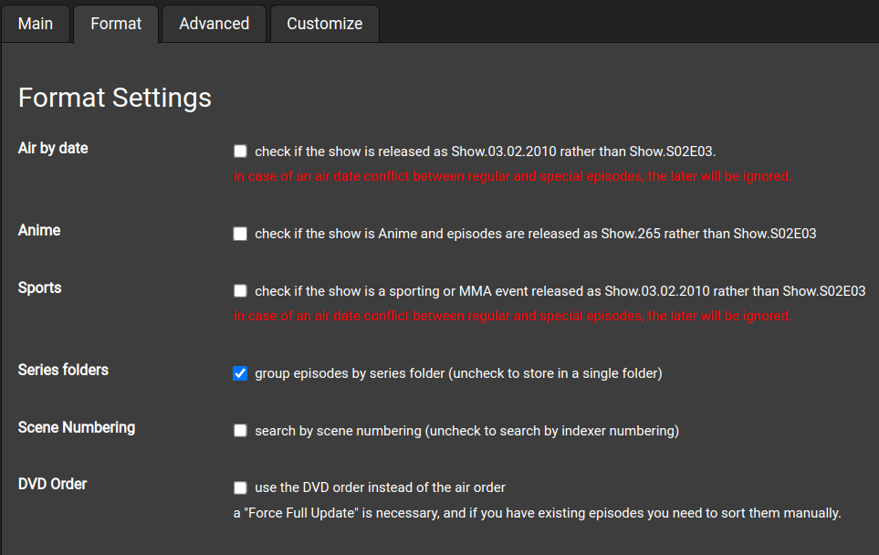

#### Format Settings

- `Air by date:` Select if the shows contains the air-date instead of the normal S01E01 format in the title.
- `Anime:` Select if the show only contains an episode number instead of the normal S01E01 format in the title.
- `Sports:` Shows release with dates rather than other formats.
- `Season folders:` Store episodes in season folders. Disable if you like all episodes in one folder. Note: _doesn't work with some systems._
- `Scene Numbering:` Enable or disable Scene Numbering. See [Scene Numbering](Scene-exceptions-and-numbering.md#what-is-scene-numbering) for more info.
- `DVD Order:` Presently _unavailable_ with theTVDB APIv3.

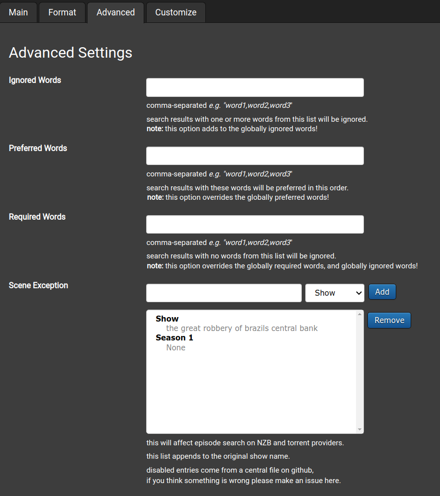

#### Advanced Settings

- `Ignored Words:`  
  All releases containing those words will be skipped.! Use with caution.! Separate words with a comma, e.g. "word1,word2,word3"
- `Prefered Words:`  
  All releases containing these words will be preferred in this order! Separate words with a comma, e.g. "word1,word2,word3"
- `Required Words:`  
  All releases NOT containing those words will be skipped.! Use with caution.! Separate words with a comma, e.g. "word1,word2,word3"
- `Scene Exception:`  
  Lets you set and remove Scene Exceptions. See [Scene exceptions and numbering](Scene-exceptions-and-numbering.md) for more info.

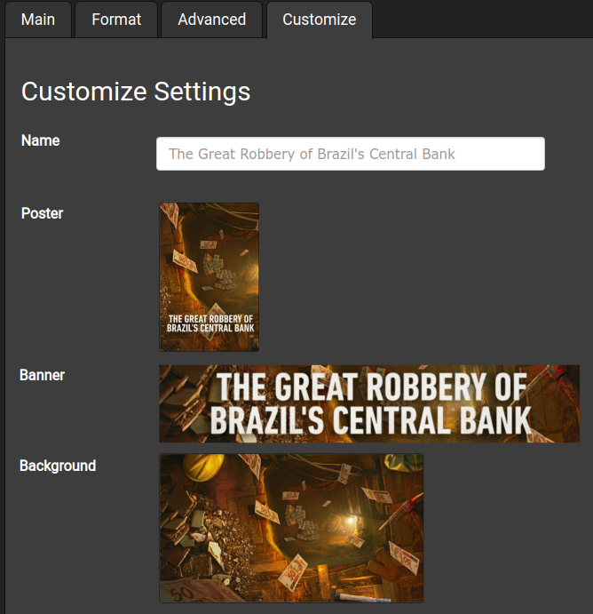

#### Customize Settings

- `Name:`  
  Show name for easy reference
- `Poster, Banner, Background:`  
  The images displayed for the show. Select the image to search for or upload alternate images. Options are _Upload, Fanart, TMDB, theTVDB_ as sources.
