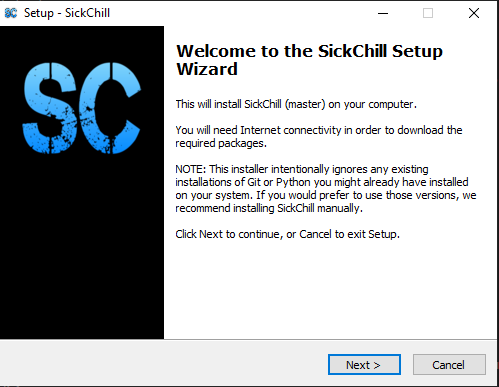
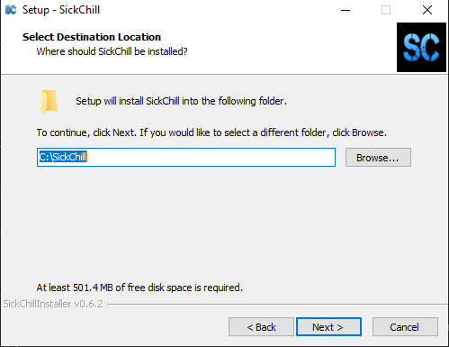
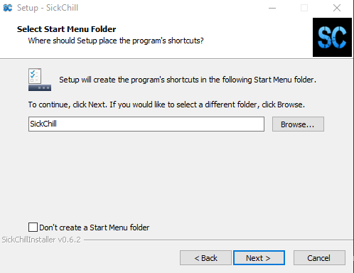
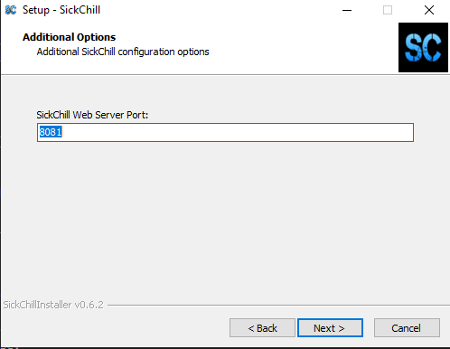
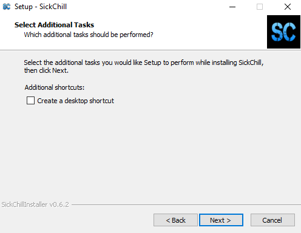
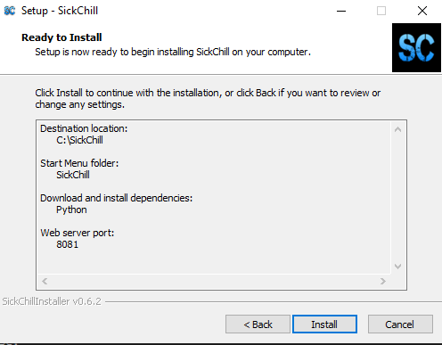
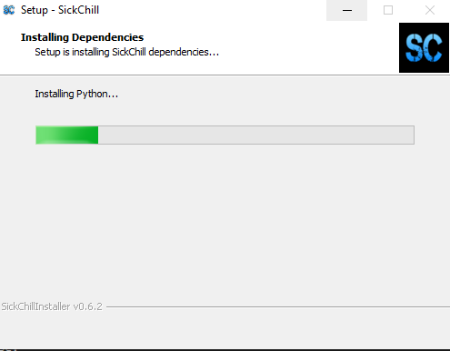
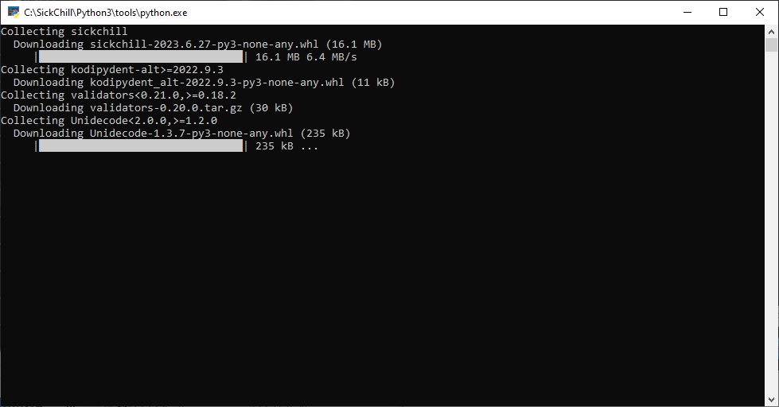
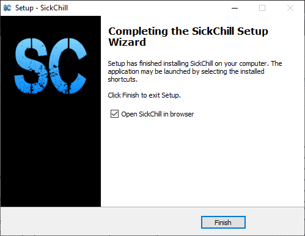
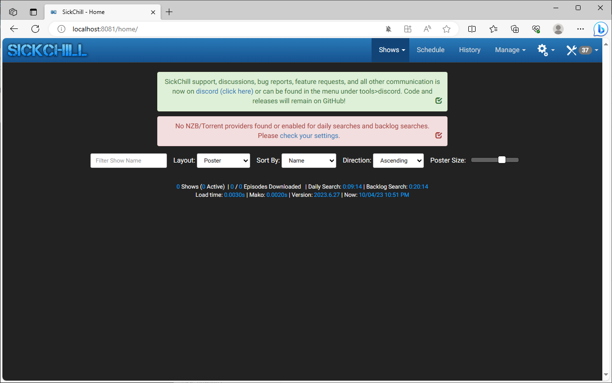

## Introduction

---

For many novice users installing SickChill on a Windows machine can be confusing.
Therefore we have created a Windows installer to simplify the process. This installer will download all the necessary files and automatically install them for you.
It also will take care of creating a service, so that SickChill will automatically start with Windows.
Both x32 and x64-bit installations are supported and automatically recognized.

For more detailed information checkout https://github.com/SickChill/SickChillInstaller#sickchillinstaller

## Network drive mappings

The installer uses a service (account) to run SickChill automatically on startup. This is a different account than your Windows user account which you use to login to Windows. Meaning that any network drive mappings do not exist for that (service) account and need to be created.
Or edit the service to run with another [account](https://technet.microsoft.com/en-us/library/cc755249.aspx) that has the network drive mappings setup.
You can manually change the account from the command prompt (administrative rights) with the below commands. :

```
sc config "SickChill" obj= "username" password= "password"
sc restart SickChill
```

If you are unable to get those setup correctly, you can always disable the service and start SickChill manually. SickChill will then run as the user that is logged in to Windows. Alternatively, you can also install SickChill [manually](SickChill-Windows-Installer.md#manual-installation-guides-for-windows)

### Enable Linked Connections

If you are having issues with networked drives, you likely need to [enable linked connections](https://learn.microsoft.com/en-us/troubleshoot/windows-client/networking/mapped-drives-not-available-from-elevated-command):

#### With Registry tool:

```
reg add "HKEY_LOCAL_MACHINE\Software\Microsoft\Windows\CurrentVersion\Policies\System" /v "EnableLinkedConnections" /t REG_DWORD /d 0x00000001 /f
```

OR

#### With PowerShell:

```
New-ItemProperty -Path 'HKLM:\SOFTWARE\Microsoft\Windows\CurrentVersion\Policies\System' -Name EnableLinkedConnections -Value 1 -PropertyType 'DWord'
```

---

## Installing SickChill on Windows

Head over to the [SickChill Package Installer](https://github.com/SickChill/SickChillInstaller/releases) and download the latest release.  
(Special thanks to VinceVal for compiling this installer.)

Browse to the folder/location where you have placed the installer file and execute/run it.  
(You might get a warning from `users account control` that the program is `Unknown`. Just ignore the warning, and click on `OK`.)

--



You will be greeted by the welcome screen.
Click on `Next >` to proceed with the installation.

--



The next window lets you select the destination folder where you want SickChill to be installed. the default is `C:\SickChill`  
Use `Browse...` if you would like to change that location. Or enter the destination manually in the text field.  
Click on `Next >` to proceed with the installation.

--



The next window will ask if you would like a shortcut to be created in your start menu.  
If not than check the check-box `Don't create a Start Menu folder`  
Click on `Next >` to proceed with the installation.

--



The next window will let you set the port on which SickChill will run. The default is `8081` and it's advised not to change this, unless you have a good reason for it.  
Click on `Next >` to proceed with the installation.

--



The next window will ask if you would like to create a shortcut for SickChill on your desktop.  
For ease, it's recommended to create a shortcut on the desktop. But you can also decide to save the URL as a bookmark/favorite in your browser later.  
Click on `Next >` to proceed with the installation.

--



The next window shows you an overview of the settings you have selected and the dependencies that will be installed together with SickChill.  
(Those dependencies are needed to run and update SickChill on your Windows machine.)  
Click on `Install` to proceed with the installation.

--



The next window will start downloading the necessary files that are going to be used to install SickChill.

--



The next window will show you the installation of the downloaded files, this can take a moment depending on your machine.

--



When the installation is complete you will get the `Finish` screen. Simply click on `Finish` to complete the installation.  
Congratulations, you have successfully installed SickChill.! :+1:

--



Now you can access SickChill by opening your favorite browser and go to http://localhost:8081 to open SickChill's Web-interface.

--

---

## Manual installation guides for Windows

In case you prefer to do the installation manually, then you can have a look at the below guides. Note that Cheetah isn't necessary anymore, so you don't have to install it.

`Official Windows installer:`  
https://github.com/SickChill/SickChillInstaller
