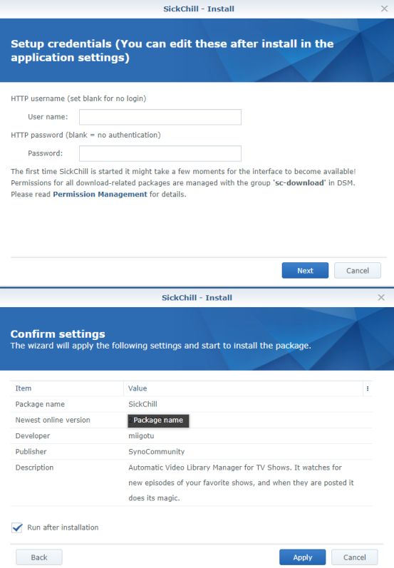

===

Luckily this is very easy and can be preformed with a few simple steps.

Summary:

1. Go into SickChill and make a backup.
2. Go to the Synology Package Center and remove the old package SickChill.
3. Then install latest SickChill package from [SynoCommunity](https://synocommunity.com/).
4. Restore your backup, and restart SickChill.

That's it :+1:

Note: By default the Synocommunity SickChill package uses port 8081, and prior Synocommunity packages used port 8083 or 8899. So if you restore your backup between the two the port will also be restored back. Therefor make sure you open the SickChill page with the correct port. Once running change to 8081 to align with package center link.

###### Need more Synology SickChill info

See the [Synology](Synology) set up guide for troubleshooting and other fun DSM information.

---

## Explained with illustrations.

Login to SickChill and go to Backup and Restore in the configuration. Create a backup and store it in a safe location.


Login to Synology's DSM and go into the Package Center and open the SickChill Package. There Select Remove.


On the conformation window pres `YES`.

###### Install SickChill

Now that SickChill is removed we need to (re)install it again. Go to the community overview of Packages, find SickChill and click on `Install`.

# 

Now you will get a wizard/installation screen. Fill-in the username and password or leave blank.  
`Run after installation"` Is as labelled, run immediately after installation complete or allow you to run manually. Manual start is when you have to put your own `config.ini` and `sickchill.db` files in yourself.

# 

SickChill is now (re)installed.  
Open the GUI and go to Backup/Restore under configuration and restore your backup.

# 

Last thing you need to do is a restart of SickChill so the changes take effect.

# 

That's all, you are now running on the new Repository. :)

In some cases you can get a cache warning after restoring the backup. You can ignore those.

```
MAIN :: Restore: Unable to remove the cache/sessions directory: error 2 : No such file or directory
MAIN :: Restore: Unable to remove the cache/indexers directory: error 2 : No such file or directory
```

## Synology SickChill Permissions

Setting permissions for files and folder access in your DSM are key to SC being able to put things in the right place.

There are multiple ways to have SC access your folders. You can do it per [SynoCommunity Permissions](https://github.com/SynoCommunity/spksrc/wiki/Permission-Management) wiki page, or add your own `group` with read/write permissions on folders where you want SC to access files and folders.

The user:group are:  
**DSM6** sc-sickchill:sc-download  
**DSM7** sc-sickchill:synocommunity

Note:  
The user and group are `system internal user` and not directly assignable in DSM gui and the installation of SC through the `package center` will create these.

How to:  
Create `yourgroup` through control panel `User & Group` then ssh and add `sc-sckchill` to `yourgroup` using

```
sudo synogroup --memberadd yourgroup sc-sickchill
```

Adjusting access to folders via gui using `yourgroup` in `File Station` is now possible.
